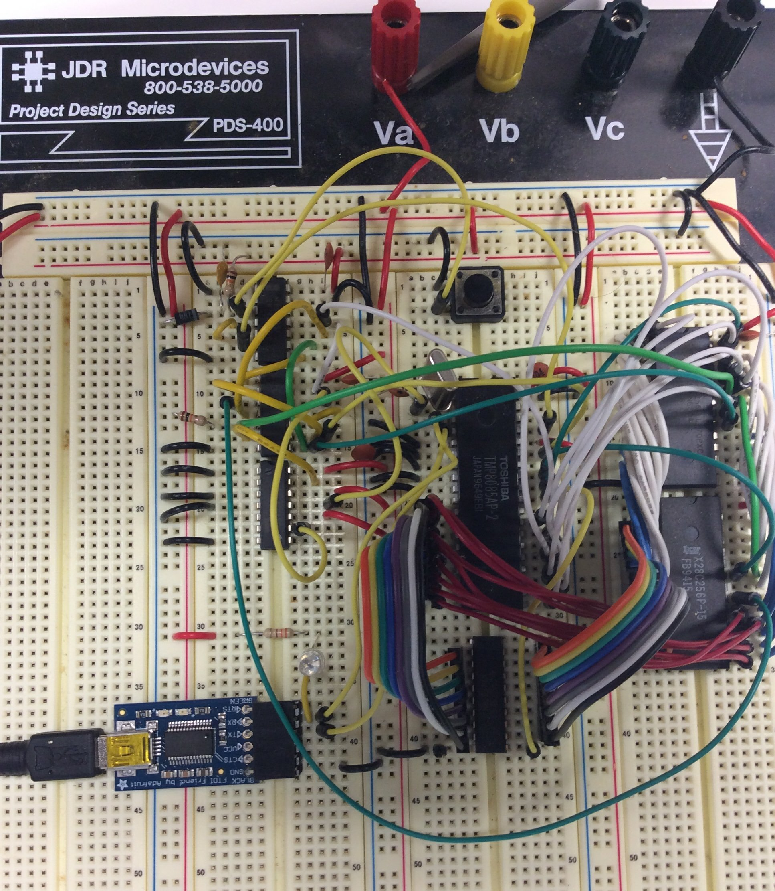

# Simple 8085 System
This is a design for a simple 8085-based single-board computer.  It was started as a way to run the software from an old Netronics Explorer/85 board from the early 1980s.  The primary purpose of the design is software compatibility, rather than building a chip-for-chip clone of the Explorer.  Chips in this design, such as the 32K EEPROM, were not available when the Explorer was being produced.

This project was inspired by the [Glitch Works 8085 SBC](http://www.glitchwrks.com/2011/10/29/sbc-rev-2) and the [Saundby MAG-85](http://saundby.com/electronics/8085/)

## Explorer/85 Design
The Explorer/85 was an S100 system designed around the Intel 8085 processor.  It was sold in kit form, with various options ranging from a simple processor trainer to a full-fledged computer with floppy drives and external expansion cards.  [This article and ad from Popular Electronics in 1981](docs/explorer85-popelec1081.pdf) have more details about the system.

The system being emulated here was a serial-terminal based Explorer with the following options:
* Level A - computer kit - terminal version with 256 bytes(!) of RAM and 2K Monitor ROM
* Level B - S100 bus drivers and additional memory decoding
* Level D - 4K memory expansion
* Level E - 8K Microsoft Basic in ROM

## Simple8085 Design
The Simple8085 differs from the original hardware in a few key areas that required changes to the Monitor software:
* The S85 has RAM from 0000 t0 7fff and ROM from 8000 to ffff.  The E85 has RAM at 0000 and ROM at F000, but it also has 256 bytes of RAM at F800 from the 8155 chip.  These area had to be moved to the top of the 0000 RAM in the Monitor code.
* The E85 has timers and IO ports in the 8155 and 8355 that are used by the monitor to do single step.  The Monitor's initialization code for this hardware was removed.
* The E85 has hardware support for RS232 via the SOD and SID pins.  Computers with RS232 serial ports are getting rare, so the S85 connects the SID and SOD pins to an FTDI board to convert the serial to USB instead.  This simplified the hardware and eliminated the need for the negative 8 volt supply used on the E85.  No software changes were needed for this.

## Development and Additional Tools
To get the original Netronics software running on a new platform, several additional tools were developed.  The complete project consisted of the following:
* Create a software-compatible 8085  computer
* Extract the contents of the original ROMs by booting the Explorer, using the Monitor to dump the ROMs, and capturing the terminal output.
* The ROM content, plus the symbol table from the Monitor Source Listing, was fed into the [DASMx disassembler](http://myweb.tiscali.co.uk/pclare/DASMx/) to create a Monitor ROM source that could be modified to account for some small hardware differences between the two systems.
* The modified Monitor was re-assembled with a [new cross assembler](https://github.com/TomNisbet/asm85) that was written for this project.
* The new Monitor binary image and the original Basic ROM image were burned into the EEPROM using an [Arduino-based EEPROM reader/writer](https://github.com/TomNisbet/TommyPROM) that was created for this project.

## Memory addressing and Power-on Jump
The memory addressing hardware should be trivial.  With 32K ROM and 32K RAM, it could be as simple as running A15 to one chip select and inverted A15 to the other.  The complication arises from the reset condition.

To be compatible with the original Explorer/85 and other CP/M systems, the RAM needs to start at 0000.
At reset, the 8085 program counter goes to 0000H, but the entry point to the system monitor is located in ROM starting at 8000. 

The complete memory addressing circuit is shown below.  This selects the RAM if the system is not in reset and A15 is low.  Otherwise it selects the ROM.  Neither is selected if IO/M is selecting IO.

Power-on jump is accomplished with a combination of hardware and software.  The hardware forces the ROM to be selected when in the reset state.  This condition is maintained until A15 goes high.  The software requires that first instruction in the ROM be a jump to a ROM location.  In this implementation, it is a jump to the beginning of the Monitor at F000.  Before the jump is executed, the processor's PC is at 0000, not 8000.  The jump causes the PC to go from 0000 to F000, raising the A15 line and clearing the reset flip flop.  From this point, ROM and RAM are addressed normally.

The image above shows the reset jump circuit in action, as captured by the excellent [Saleae Logic Analyzer](http://www.saleae.com).  The numbers shown above the Read line are a decode of address lines A0..A7.

The trace begins with the processor in reset, which has caused the reset flip-flop's output (Reset FF Q) to go high.  As the processor comes out of reset (seen by Reset Out falling), ROMEN is asserted due to the Reset flip flop.  The first instruction read from ROM is a 3 byte jump instruction to F000.  The is read from the ROM at 8000, although the processor's PC is actually at 0000.  After the jump, A15 goes high, clearing the flip flop.  At this point, RAM and ROM are now addressed normally, using A15 low and high, respectively.

The code fragment below matches the logic analyzer trace.  After the last part of the STA instruction is fetched at F00B, the trace shows the write to RAM at 7F78.

                        SYSRAMST   equ 00000h
                        SYSROMST   equ 08000h
                        
                        ; Leave the Monitor at its original location so it will be compatible
                        ; with the Basic ROMs.  This jump at the beginning of ROM will execute
                        ; when reset enables the ROM at 0000.
                                ORG     SYSROMST
    8000 c3 00 f0               jmp     BOOT        ; Start the Monitor
                        
                        ; Start of Monitor
                                ORG     0F000H
                        BOOT:
    f000 c3 03 f0               jmp     START       ; This is the original jump to
                                                    ; clear the reset flip flop.
                        START:
    f003 3e 8d                  mvi     a,08DH
    f005 00                     nop
    f006 00                     nop 
    f007 3e 09                  mvi     a,009H
    f009 32 f8 7f               sta     USCSR
    f00c 00                     nop

## The Hardware
Initially, the system was prototyped on a solderless breadboard in the hopes that some basic functionality could be proven before spinning a real PCB.

The system was slowly built up and tested as new components were added.
* The first test was to wire up the processor with pull-down resistors on the data lines, forcing it to read a NOP for every instruction read.  This would cycle though the entire address range forever and would prove the basic processor functionality.  This test passed and produced a cool lightshow when LEDs were wired to the address lines.
* The next test was to wire in the address/data latch and to connect the ROM.  An inital test program was loaded that blinked an LED from the SOD line.
* The next test, with the same hardware, was to wire in the FTDI chip to the SOD and bit-bang a character out as async serial data.
* The next test was to wire in the RAM chip, and modify the test program to write some characters to RAM and read them back before outputting them as serial data.
At this point, the processor, ROM, and RAM had all been proven, at least for simple operations.  The address decoding and power-on jump logic were then added.  Rather than writing a new test, the entire Monitor ROM and Basic were loaded.  Incredibly enough, it worked.

## Next Steps
Given that the system is functioning on a breadboard, it may not ever be spun into a real PCB.  After all, the point was about getting it all working.  There are additional software modifications that may still happen, such as:
* Replace the cassette interface code in the Monitor with XMODEM save and restore.  This would allow the state to be saved to a host computer.
* Support on-board writing to the EEPROM so that the chip does not need to be pried out and replaced for each change to the system software.
* Add additionl languages and tools to the ROM.  Possibly Forth, Assembler, or an editor.
