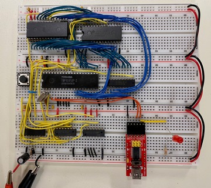

# Simple 8085 System

This is a design for a simple 8085-based single-board computer on  a breadboard.  It was started as a way to run the software from an old Netronics Explorer/85 board from the early 1980s.  The primary purpose of the design is software compatibility, rather than building a chip-for-chip clone of the Explorer.

The [Simple8085 Documentation Pages](https://tomnisbet.github.io/Simple8085/) have a complete descripton of the design, plus build steps, utilities, and test programs.
