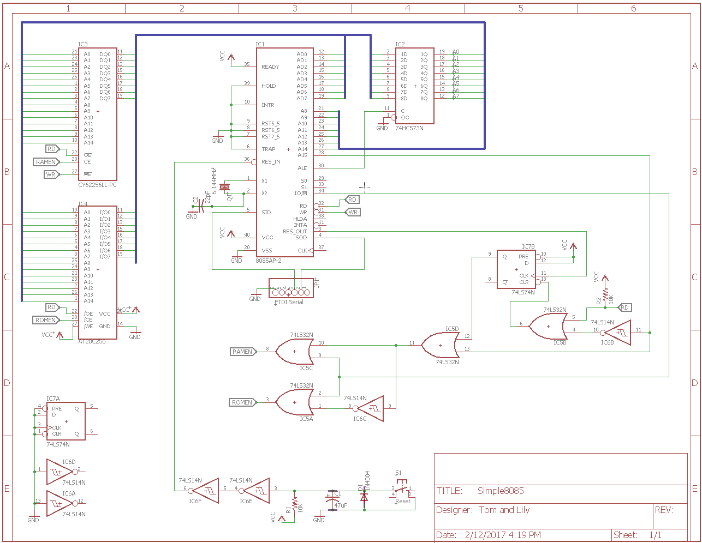
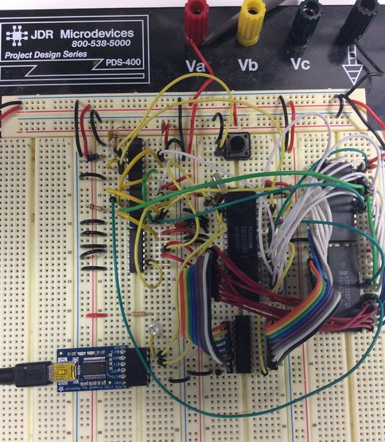

# Simple 8085 System
This is a design for a simple 8085-based single-board computer.  It was started as a way to run the software from an old Netronics Explorer/85 board from the early 1980s.  The primary purpose of the design is software compatibility, rather than building a chip-for-chip clone of the Explorer.  Some chips in this design, such as the 32K EEPROM, were not available when the Explorer was being produced.

This project was inspired by the [Glitch Works 8085 SBC](http://www.glitchwrks.com/2011/10/29/sbc-rev-2) and the [Saundby MAG-85](http://saundby.com/electronics/8085/)



## Explorer/85 Design
The Explorer/85 was an S100 system designed around the Intel 8085 processor.  It was sold in kit form, with various options ranging from a simple processor trainer to a full-fledged computer with floppy drives and external expansion cards.  [This article and ad from Popular Electronics in 1981](docs/explorer85-popelec1081.pdf) has more details about the system.


The system being emulated here was a serial-terminal based Explorer with the following options:
* Level A - computer kit - terminal version with 256 bytes(!) of RAM and 2K Monitor ROM
* Level B - S100 bus drivers and additional memory decoding
* Level D - 4K memory expansion
* Level E - 8K Microsoft Basic in ROM

## Simple8085 Design
The Simple8085 (S85) differs from the original Explorer/85 (E85) hardware in a few key areas that required changes to the Monitor software:
* The S85 has RAM from 0000 t0 7FFF and ROM from 8000 to FFFF.  The E85 has RAM at 0000 and ROM at F000, but the E85 also has 256 bytes of RAM at F800 from the 8155 chip.  These area had to be moved to the top of the 0000 RAM in the S85 Monitor code.
* The E85 has timers and IO ports in the 8155 and 8355 that are used by the monitor to do single step.  The S85's Monitor initialization code for this hardware was removed.
* The E85 has hardware support for RS232 via the SOD and SID pins.  Computers with RS232 serial ports are getting rare, so the S85 connects the SID and SOD pins to an FTDI board to convert the serial to USB instead.  This simplified the hardware and eliminated the need for the negative 8 volt supply used on the E85.  No software changes were needed for this.

## Development and Additional Tools
To get the original Netronics software running on a new platform, several additional tools were developed.  The complete project consisted of the following:
* Create a software-compatible 8085  computer
* Extract the contents of the original ROMs by booting the Explorer, using the Monitor to dump the ROMs, and capturing the terminal output.
* The ROM content, plus the symbol table from the Monitor Source Listing, was fed into the [DASMx disassembler](http://myweb.tiscali.co.uk/pclare/DASMx/) to create a Monitor ROM source that could be modified to account for some small hardware differences between the two systems.
* The modified Monitor was re-assembled with a [new cross assembler](https://github.com/TomNisbet/asm85) that was written for this project.
* The new Monitor binary image and the original Basic ROM image were burned into the EEPROM using [TommyPROM - an Arduino-based EEPROM reader/writer](https://github.com/TomNisbet/TommyPROM) that was created for this project.

## Memory addressing and reset-mode flip-flop
The memory addressing hardware should be trivial.  With 32K ROM and 32K RAM, it could be as simple as running _A15_ to the ROM Chip Enable and inverted _A15_ to the RAM Chip Enable.  The would put the ROM at 0000-7FFF and the RAM at 8000-FFFF.  The complication arises from the reset condition.

To be compatible with the original Explorer/85 and other CP/M systems, the RAM needs to start at 0000.  The difficulty with this is that at system reset, the 8085 program counter goes to 0000H to start executing code, but there won't be any code present in RAM at power up.  The Memory Addressing circuit compensates for this by forcing the ROM to be selected at RESET.  This makes the ROM appear twice in the address space, at 0000-7FFF and again from 8000-FFFF.  During the reset condition, the code normally in the ROM at address 8000 is read at address 0000.

The complete memory addressing circuit is shown below.  Normally, the RAM (0000-7FFF) is selected when _A15_ is LOW and the ROM (8000-FFFF) is selected when _A15_ is HIGH.  Neither chip is selected if _IO/M_ is indicating IO.  The special case it that the _RES_OUT_ signal sets a flip-flop to force the ROM to be selected.  This flip-flop is reset when _RD_ goes LOW and _A15_ goes HIGH, indicating a read of the top half of the memory where the ROM normally lives.

Note that the inverters used in the memory addressing circuit are 74LS14 Schmitt-trigger inverters.  This is simply because there were two inverters left over from the power-on reset circuit.  Standard inverters would work equally well here.


Reset-mode addressing is accomplished with a combination of hardware and software.  The hardware forces the ROM to be selected when in the RESET state.  This condition is maintained until _A15_ goes high.  The software requires that first instruction in the ROM be a jump to a ROM location.  In this implementation, it is a jump to the beginning of the Monitor at F000.  Before the jump is executed, the processor's PC is at 0000, but is executing code that is assembled to start at 8000.  The jump causes the PC to go from 0000 to F000, raising the A15 line and clearing the reset flip flop.  From this point, ROM and RAM are addressed normally, with RAM starting at 0000 and ROM at 8000.


The image above shows the reset jump circuit in action, as captured by the excellent [Saleae Logic Analyzer](http://www.saleae.com).  The numbers shown above the Read line are a decode of address lines A0..A7.

The trace begins with the processor in reset, which has caused the reset flip-flop's output (Reset FF Q) to go high.  As the processor comes out of reset (seen by Reset Out falling), _ROMEN_ is asserted due to the Reset flip flop.  The first instruction read from ROM is a 3 byte jump instruction to F000.  This is read from the beginning of the ROM, which would normally be at address 8000, although the processor's PC is actually at 0000.  After the jump, _A15_ goes high, clearing the flip flop.  At this point, RAM and ROM are now addressed normally, using _A15_ low and high, respectively.

The code fragment below matches the logic analyzer trace.  After the last part of the STA instruction is fetched at F00B, the trace shows the write to RAM at 7F78.

```assembly
                    SYSRAMST   equ 00000h
                    SYSROMST   equ 08000h

                    ; Leave the Monitor at its original location so it will be compatible
                    ; with the Basic ROMs.  This jump at the beginning of ROM will execute
                    ; when reset enables the ROM at 0000.
                            ORG     SYSROMST
8000 c3 00 f0               jmp     BOOT        ; Start the Monitor

                    ; Start of Monitor
                            ORG     0F000H
                    BOOT:
f000 c3 03 f0               jmp     START       ; This is the original jump to
                                                ;   clear the reset flip flop.
                    START:
f003 3e 8d                  mvi     a,08DH
f005 00                     nop
f006 00                     nop
f007 3e 09                  mvi     a,009H
f009 32 f8 7f               sta     USCSR
f00c 00                     nop
```

## The Build

[](docs/simple8085.jpg)

Initially, the system was prototyped on a solderless breadboard in the hopes that some basic functionality could be proven before spinning a real PCB.  Starting with the 8085 chip, functionality was tested as new components were added.

### Step 1: Free-run Test

[](docs/step1-free-run-sch.png)[](docs/step1-free-run.jpg)

The first test was to wire up the processor with pull-down resistors on the data lines, forcing it to read a NOP for every instruction read.  This cycles though the entire address range forever and proves the basic processor functionality.  If the test is working correctly, the _A15..A8_ address lines will all toggle, with _A14_ twice as fast as _A15_, _A13_ twice _A14_, and so on.  This can be observed with an oscilloscope or logic analyzer, or even an LED and resistor on the top address lines if a slower clock crystal is used.

This test passed and produced a cool light show when LEDs were wired to the address lines.

The only parts needed for this are the 8085, clock crystal, and eight resistors for the _AD0..AD7_ lines.  
* wire the _X1 and _X2_ to the crystal, as in the final schematic
* connect each _ADn_ line to _GND_ though a 1K or similar resistor
* connect _SID_, _HOLD_, _INTR_, _TRAP_, and the _RSTn_ lines to _GND_
* connect _READY_ and _RESET_IN_ to _5V_
* leave other signals unconnected, including _RD_, _WR_, _SOD_, and _ALE_


### Step 2: ROM

[](docs/step1-rom-led-sch.png)

The next test was to wire in the address/data latch and to connect the EEPROM.  An initial test program was loaded that blinks an LED from the SOD line.  The RESET button and the associated power-on reset circuit were also added at this point.

To add the ROM to the 8085, make the following connections as in the final schematic:
* 8-bit latch control and inputs to the _ALE_ and _AD0..7_ lines
* EEPROM _A0..A7_ to the address latch outputs
* data pins of the EEPROM to _AD0..7_
* EEPROM _A8..14_ to the 8085 _A8..14_
* EEPROM _OE_ to _RD_
* EEPROM _WE_ to _5V_

Also connect the following:
* 8085 _SOD_ to an LED and resistor to _GND_
* EEPROM _CE_ to _GND_  (this maps the ROM base address at both 0000 and 8000)

Burn the [ROM LED test program](code/test2a-rom-led.asm) into the EEPROM at starting address 0.  Note that this program starts with a _JMP_ instruction to clear the reset flip-flop.  This isn't needed, but means that the program will also work if the final address decoding hardware is installed.

If the test above suceedes, basic ROM wiring has been verified.  A [second test program]code/test2b-rom-address.asm) can now be run to verify that all of the upper ROM address lines have been connected correctly.  It will flash the LED at different speeds for a successful test or do a continuous fast blink on failure.

### Step 3: Serial Communications
The next test, with the same hardware, was to wire in the FTDI chip to the SOD and bit-bang a character out as async serial data.  The [ROM serial test program](code/test3-rom-serial.asm) writes a continuous stream of the 'T' character to the serial port.

* remove the LED from SOD
* connect an FTDI interface to SID and SOD as shownin the final schematic

Note that this program uses timing loops that are dependent on the frequency of the clock crystal.  A different crystal would require different delay loop values.  The connected termnal should be set for 9600bps.

### Step 4: RAM
The next test was to wire in the RAM chip and modify the test program to write some characters to RAM and read them back before outputting them as serial data.

To add the RAM to the 8085, make the following connections as in the final schematic:
* RAM _A0..A7_ to the address latch outputs
* data pins of the RAM to _AD0..7_
* RAM _A8..14_ to the 8085 _A8..14_
* RAM _OE_ to _RD_
* RAM _WE_ to _WR_

Also connect the following:
* EEPROM _CE_ to 8085 _A15_ (this maps the ROM base address at 0000)
* RAM _CE_ to *inverted* 8085 _A15_ (this maps the RAM base address at 8000)

The [RAM serial test program](code/test4-ram-serial.asm) writes a continuous string of A to Z characters to the serial port.

### Step 5: Memory Addressing
At this point, the processor, ROM, and RAM had all been proven, at least for simple operations.  The address decoding and power-on jump logic were then added to swap the RAM and ROM starting addresses, making them compatible with the Explorer/85.

Rather than writing a new test, the entire Monitor ROM and Basic were loaded from the Explorer.  Incredibly enough, it worked.


## Next Steps
Given that the system is functioning on a breadboard, it may not ever be spun into a real PCB.  After all, the point was about getting it all working.  There are additional software modifications that may still happen, such as:
* Replace the cassette interface code in the Monitor with XMODEM save and restore.  This would allow the state to be saved to a host computer.
* Support on-board writing to the EEPROM so that the chip does not need to be pried out and replaced for each change to the system software.
* Add additional languages and tools to the ROM.  Possibly Forth, Assembler, or an editor.
