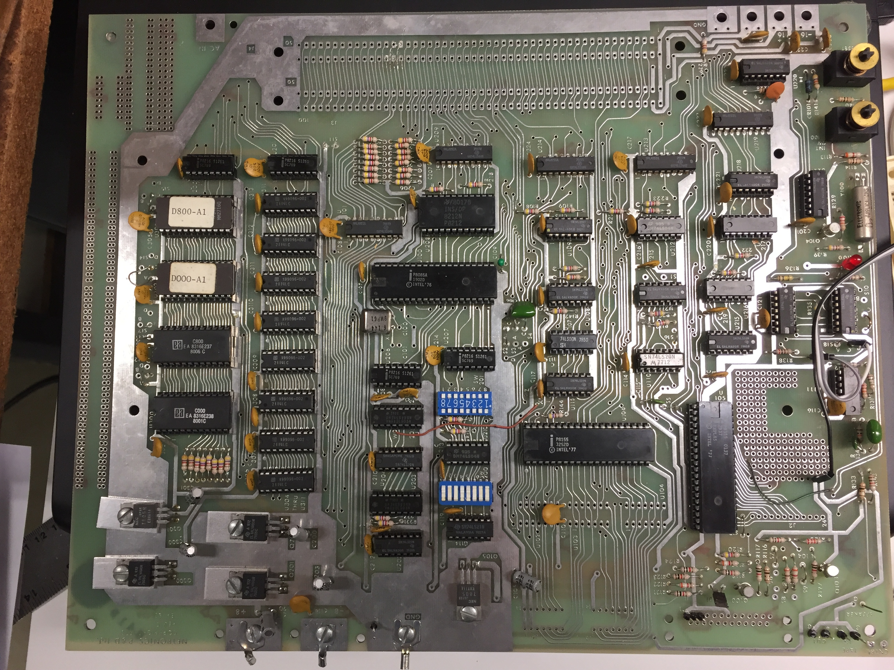
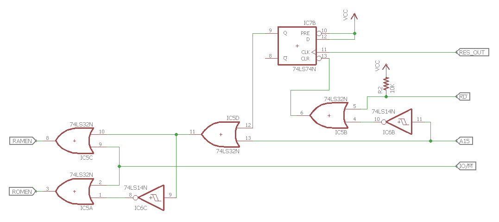
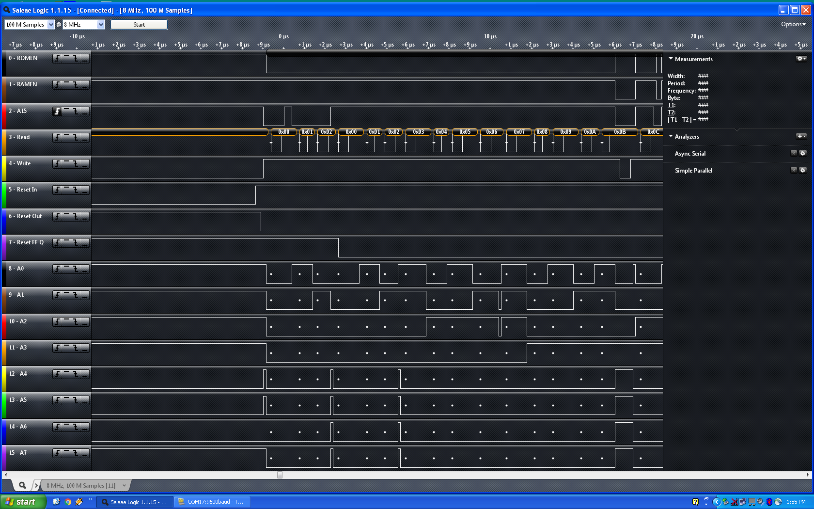

## Explorer/85 Design

The Explorer/85 was an S100 system designed around the Intel 8085 processor.  It was sold in kit form, with various options ranging from a simple processor trainer to a full-fledged computer with floppy drives and external expansion cards.  [This article and ad from Popular Electronics in 1981](images/explorer85-popelec1081.pdf) has more details about the system.

The system being emulated here was a serial-terminal based Explorer with the following options:

* Level A - computer kit - terminal version with 256 bytes(!) of RAM and 2K Monitor ROM
* Level B - S100 bus drivers and additional memory decoding
* Level D - 4K memory expansion
* Level E - 8K Microsoft Basic in ROM

## Simple8085 Design

The Simple8085 (S85) differs from the original Explorer/85 (E85) hardware in a few key areas that required changes to the Monitor software:

* The S85 has RAM from 0000 t0 7FFF and ROM from 8000 to FFFF.  The E85 has RAM at 0000 and ROM at F000, but the E85 also has 256 bytes of RAM at F800 from the 8155 chip.  These area had to be moved to the top of the 0000 RAM in the S85 Monitor code.
* The E85 has timers and IO ports in the 8155 and 8355 that are used by the monitor to do single step.  The S85's Monitor initialization code for this hardware was removed.
* The E85 has hardware support for RS232 via the SOD and SID pins.  Computers with RS232 serial ports are getting rare, so the S85 connects the SID and SOD pins to an FTDI board to convert the serial to USB instead.  This simplified the hardware and eliminated the need for the negative 8 volt supply used on the E85.  No software changes were needed for this.

## Memory addressing and reset-mode flip-flop

The memory addressing hardware should be trivial.  With 32K ROM and 32K RAM, it could be as simple as running _A15_ to the ROM Chip Enable and inverted _A15_ to the RAM Chip Enable.  The would put the ROM at 0000-7FFF and the RAM at 8000-FFFF.  The complication arises from the reset condition.

To be compatible with the original Explorer/85 and other CP/M systems, the RAM needs to start at 0000.  The difficulty with this is that at system reset, the 8085 program counter goes to 0000H to start executing code, but there won't be any code present in RAM at power up.  The Memory Addressing circuit compensates for this by forcing the ROM to be selected at RESET.  This makes the ROM appear twice in the address space, at 0000-7FFF and again from 8000-FFFF.  During the reset condition, the code normally in the ROM at address 8000 is read at address 0000.

The complete memory addressing circuit is shown below.  Normally, the RAM (0000-7FFF) is selected when _A15_ is LOW and the ROM (8000-FFFF) is selected when _A15_ is HIGH.  Neither chip is selected if _IO/M_ is indicating IO.  The special case it that the _RES_OUT_ signal sets a flip-flop to force the ROM to be selected.  This flip-flop is reset when _RD_ goes LOW and _A15_ goes HIGH, indicating a read of the top half of the memory where the ROM normally lives.

Note that the inverters used in the memory addressing circuit are 74LS14 Schmitt-trigger inverters.  This is simply because there were two inverters left over from the power-on reset circuit.  Standard inverters would work equally well here.

Reset-mode addressing is accomplished with a combination of hardware and software.  The hardware forces the ROM to be selected when in the RESET state.  This condition is maintained until _A15_ goes high.  The software requires that first instruction in the ROM be a jump to a ROM location.  In this implementation, it is a jump to the beginning of the Monitor at F000.  Before the jump is executed, the processor's PC is at 0000, but is executing code that is assembled to start at 8000.  The jump causes the PC to go from 0000 to F000, raising the A15 line and clearing the reset flip flop.  From this point, ROM and RAM are addressed normally, with RAM starting at 0000 and ROM at 8000.

The image above shows the reset jump circuit in action, as captured by the excellent [Saleae Logic Analyzer](http://www.saleae.com).  The numbers shown above the Read line are a decode of address lines A0..A7.

**INFO**: The [Debugging page](debugging) has notes on debugging with a logic analyzer.
{: .notice--info}

The trace begins with the processor in reset, which has caused the reset flip-flop's output (Reset FF Q) to go high.  As the processor comes out of reset (seen by Reset Out falling), _ROMEN_ is asserted due to the Reset flip flop.  The first instruction read from ROM is a 3 byte jump instruction to F000.  This is read from the beginning of the ROM, which would normally be at address 8000, although the processor's PC is actually at 0000.  After the jump, _A15_ goes high, clearing the flip flop.  At this point, RAM and ROM are now addressed normally, using _A15_ low and high, respectively.

The code fragment below matches the logic analyzer trace.  After the last part of the STA instruction is fetched at F00B, the trace shows the write to RAM at 7F78.


                    SYSRAMST   equ 00000h
                    SYSROMST   equ 08000h

                    ; Leave the Monitor at its original location so it will be compatible
                    ; with the Basic ROMs.  This jump at the beginning of ROM will execute
                    ; when reset enables the ROM at 0000.
                            ORG     SYSROMST
8000 c3 00 f0               jmp     BOOT        ; Start the Monitor

                    ; Start of Monitor
                            ORG     0F000H
                    BOOT:
f000 c3 03 f0               jmp     START       ; This is the original jump to
                                                ;   clear the reset flip flop.
                    START:
f003 3e 8d                  mvi     a,08DH
f005 00                     nop
f006 00                     nop
f007 3e 09                  mvi     a,009H
f009 32 f8 7f               sta     USCSR
f00c 00                     nop

