[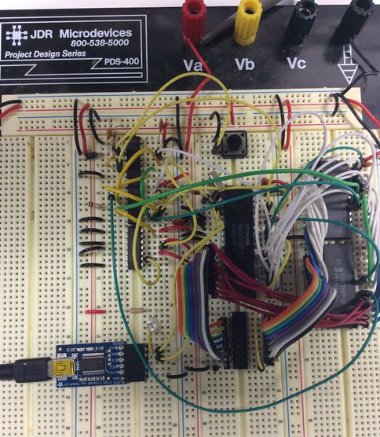](images/simple8085.jpg)

Initially, the system was prototyped on a solderless breadboard in the hopes that some basic functionality could be proven before spinning a real PCB.  Starting with the 8085 chip, functionality was tested as new components were added.

### Step 1: Free-run Test

[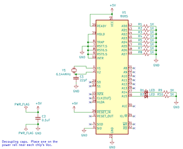](images/step1-free-run-sch.png)[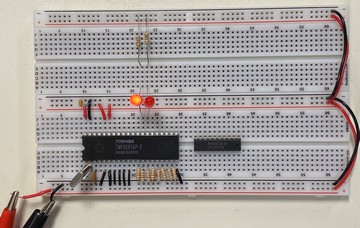](images/step1-free-run.jpg)

The first test was to wire up the processor with pull-down resistors on the data lines, forcing it to read a NOP for every instruction read.  This cycles though the entire address range forever and proves the basic processor functionality.  If the test is working correctly, the _A15..A8_ address lines will all toggle, with _A14_ twice as fast as _A15_, _A13_ twice _A14_, and so on.  This can be observed with an oscilloscope or logic analyzer, or even an LED and resistor on the top address lines if a slower clock crystal is used.

This test passed and produced a cool light show when LEDs were wired to the address lines.

The only parts needed for this are the 8085, clock crystal, and eight resistors for the _AD0..AD7_ lines.  

* wire the _X1 and _X2_ to the crystal, as in the final schematic
* connect each _ADn_ line to _GND_ though a 1K or similar resistor
* connect _SID_, _HOLD_, _INTR_, _TRAP_, and the _RSTn_ lines to _GND_
* connect _READY_ and _RESET_IN_ to _5V_
* leave other signals unconnected, including _RD_, _WR_, _SOD_, and _ALE_

### Step 2: ROM

[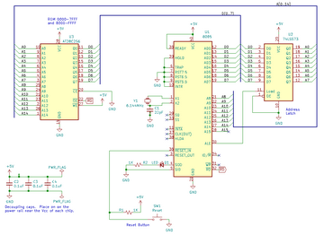](images/step2-rom-led-sch.png)[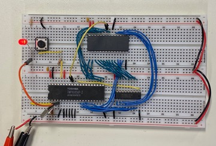](images/step2-rom-led.jpg)

The next test was to wire in the address/data latch and to connect the EEPROM.  An initial test program was loaded that blinks an LED from the SOD line.  The RESET button was also added at this point.

To add the ROM to the 8085, make the following connections as in the final schematic:

* 8-bit latch control and inputs to the _ALE_ and _AD0..7_ lines
* EEPROM _A0..A7_ to the address latch outputs
* data pins of the EEPROM to _AD0..7_
* EEPROM _A8..14_ to the 8085 _A8..14_
* EEPROM _OE_ to _RD_
* EEPROM _WE_ to _5V_

Also connect the following:

* 8085 _SOD_ to an LED and resistor to _GND_
* EEPROM _CE_ to _GND_  (this maps the ROM base address at both 0000 and 8000)
* _RESET_IN_ to _+5V_ through a 10K resistor and also to _GND_ through a pushbutton

Burn the [ROM LED test program](code/test2a-rom-led.asm) into the EEPROM at starting address 0000H.  Note that this program starts with a _JMP_ instruction to clear the reset flip-flop.  This isn't needed, but means that the program will also work if the final address decoding hardware is installed.

If the test above suceedes, basic ROM wiring has been verified.  A [second test program](code/test2b-rom-address.asm) can now be run to verify that all of the upper ROM address lines have been connected correctly.  It will flash the LED at different speeds for a successful test or do a continuous fast blink on failure.

### Step 3: Serial Communications

[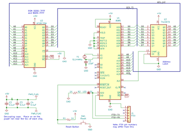](images/step3-rom-serial-sch.png)[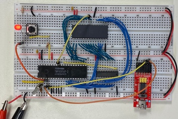](images/step3-rom-serial.jpg)

The next test, with the same basic hardware, was to wire in the FTDI chip to the SOD and bit-bang a character out as async serial data.  The [ROM serial test program](code/test3-rom-serial.asm) writes a continuous stream of the 'T' character to the serial port.

* connect an FTDI interface to _GND_, _SID_ and _SOD_ as shown in the final schematic

Note that this program uses timing loops that are dependent on the frequency of the clock crystal.  A different crystal would require different delay loop values.  The connected termnal should be set for 9600bps.

### Step 4: RAM

[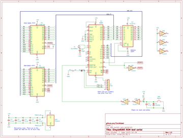](images/step4-ram-serial-sch.png)[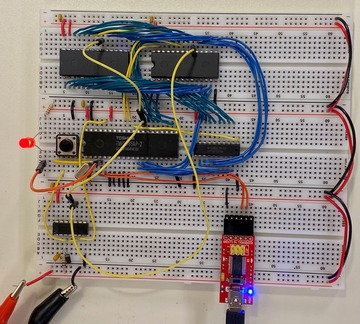](images/step4-ram-serial.jpg)

The next test was to wire in the RAM chip and modify the test program to write some characters to RAM and read them back before outputting them as serial data.  The reset circuit was also expanded to include the power-on reset in addition to the existing button.

Note that the RAM was installed where the ROM was previously located and the ROM was moved to the left where there are fewer wires. This was done to make it easier to remove the ROM for programming.  Other than the _WE_ and _CE_ pins, all other connections for the RAM and ROM are identical.

To add the RAM to the 8085, make the following connections as in the final schematic:

* RAM _A0..A7_ to the address latch outputs
* data pins of the RAM to _AD0..7_
* RAM _A8..14_ to the 8085 _A8..14_
* RAM _OE_ to _RD_
* RAM _WE_ to _WR_

Also connect the following:

* EEPROM _CE_ to 8085 _A15_ (this maps the ROM base address at 0000)
* RAM _CE_ to *inverted* 8085 _A15_ (this maps the RAM base address at 8000)
* complete the reset circuit with the addition of the inverters, capacitor, and diode

The [RAM serial test program](code/test4-ram-serial.asm) writes a continuous string of A to Z characters to the serial port.

Now that RAM is working, code development can be sped up with the use of the [Hex Loader](code/loader.asm). This can be burned into the ROM and will load and execute programs from RAM.  While not as powerful as a full monitor, it does remove the need to power down the system and remove the ROM for each code update.  It accepts Intel Hex files from [asm85](https://github.com/TomNisbet/asm85) or other tools that write in the standard format.

### Step 5: Memory Addressing

[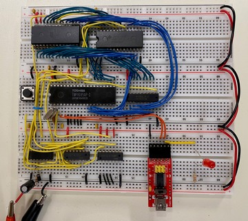](images/step5-addressing.jpg)

At this point, the processor, ROM, and RAM had all been proven, at least for simple operations.  The address decoding and power-on jump logic were then added to swap the RAM and ROM starting addresses, making them compatible with the Explorer/85.

Rather than writing a new test, the entire Monitor ROM and Basic were loaded from the Explorer.  Incredibly enough, it worked.
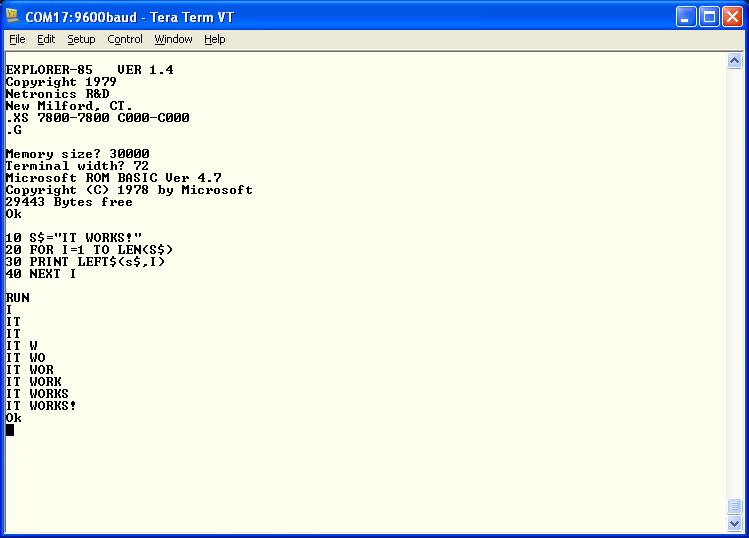

