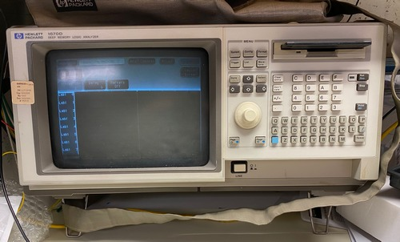
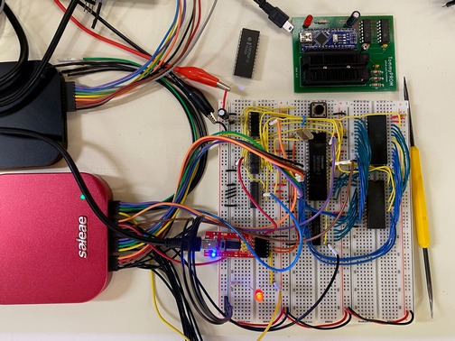
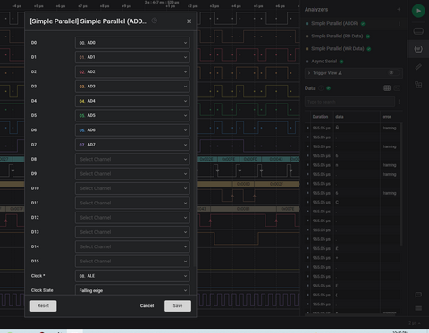
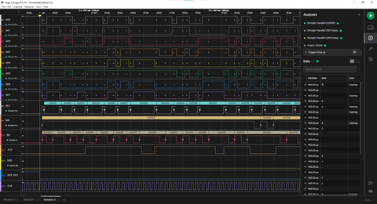
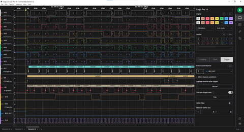

Many modern processors and controllers have JTAG or other onboard debugging assistance.  Retro processors, like the 8085 and 6502, don't have anything like this.  External tools are needed to get insight into the operation of the processor.

A logic analyzer is an invaluable tool to debug home-built computer projects, particularly in the early stages as the new hardware is being developed.

Logic analyzers were originally standalone computers, with their own display and input hardware.  These were professional lab instruments and were far too expensive for hobbyist use.  The Hewlett Packard analyzer shown here is an example of this.

There are now logic analyzers available that only provide the actual data collection hardware and leverage a computer for the analysis and data interface.  In addition to being much more affordable, these analyzers also have superior user interfaces and expandable analysis capabilities.

The Simple8085 project was developed using the [Saleae](https://www.saleae.com) Logic 16 Pro analyzer.  This can monitor 16 channels of data to give insight into the data, address, and control lines of the processor.

## Logic Analyzer Channels

Because the 8085 has 40 pins and the Logic has 16 channels, the signals to be monitored must be chosen carefully.  Monitoring the following signals gives a good view of the processor for most debugging:

|Signal     | Description |
|:---       |:---|
| AD0..AD7  | data and lower address lines |
| A15       | shows whether RAM or ROM is being addressed |
| ALE       | indicates ADx lines are presenting address or data |
| RD        | read operation  |
| WR        | write operation |
| RESET_OUT | processor running or in reset (used for trigger) |

The above signals use 13 of the 16 available lines.  Depending on the issue being debugged, other useful signals are:

|Signal     | Description |
|:---       |:---|
| SID, SOD  | monitor serial communications or other I/O |
| CLK       | useful in early board turn up and to count machine cycles |
| S0, S1    | monitor instruction cycles |
| IO/M      | differentiate between memory and I/O operations |
| interrupts| if interrupts are used |

## Logic Software Analyzers

A very powerful feature of the Logic is the set of configurable analyzers that can interpret the data present on one or more pins.  The Async Serial Analyzer can decode the serial communications on the SID and SOD lines and show the characters sent and received.

One or more Simple Parallel Analyzers can be configured to interpret the data on multiple pins when a condition is met.  Three useful parallel analyzers can be configured, all monitoring the AD0..AD7 pins, to get an in-depth view of the processor operation.

A Simple Parallel Analyzer on AD0..AD7, triggered on the falling edge of _ALE_, will capture the low 8 bytes of address for an instruction.

A second analyzer triggered on the rising edge of the _RD_ signal will show the value on the data bus during a read operation.

A third analyzer triggered on the rising edge of the _WR_ signal will show the value on the data bus during a write operation.



The screenshot below shows the output of three Simple Parallel Analyzers.  All are monitoring the _AD0..AD7_ lines and clocking on the _ALE_, _RD_, and _WR_ lines.  

* The processor is coming out of RESET.  
* On the _ALE_ line, the first three addresses are shown with the low address bytes reading 00, 01, and 02.  
* The _RD_ line shows that the three data bytes fetched are C3, 25, 80, which is a JMP 8025 instruction.  
* The next address read has 25 as the lowest address byte and the A15 line is now high, showing that the processor has jumped to 8025 and is fetching the next instruction.

The Async Serial Analyzer is also useful for 8085 debugging.  Configuring this on the SID or SOD line provides a decode of the characters sent on the serial line and verifies correct protocol framing.  This is much easier than just reading the bit transitions on the line.

## Logic Analyzer Triggers

A capture on the Logic Analyzer can be triggered on a specific event.  One good example is triggering the capture on the falling edge of _RES_OUT_.  This will capture data starting at the point where the processor comes out of the RESET condition.

Another useful trigger is the falling edge of one of the serial data lines.  This detects an async start bit, so it will capture the beginning of a serial data transmission.

